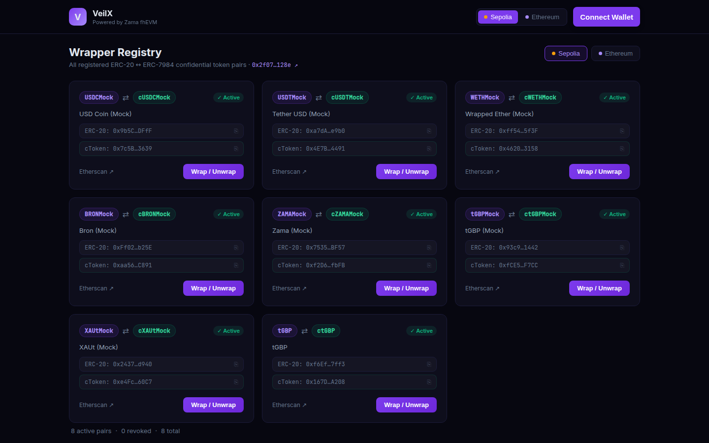
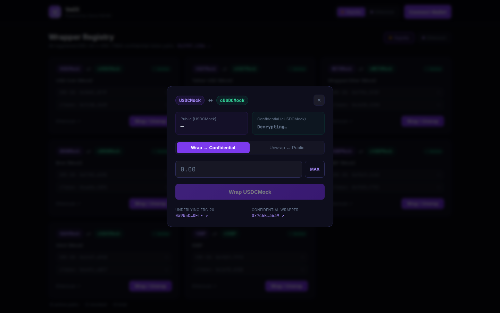

# VeilX — Confidential Wrapper Registry

> One place to discover every ERC-20 ↔ ERC-7984 confidential-token pair on Zama's protocol — and wrap, unwrap, and privately read your encrypted balance, right in the browser.

**Live demo → [veilx-app.vercel.app](https://veilx-app.vercel.app)** · Powered by [Zama fhEVM](https://zama.org) and the [ERC-7984](https://docs.zama.org/protocol/examples/openzeppelin-confidential-contracts/erc7984) confidential token standard.

> 🏆 Built for the **Zama Developer Program — Mainnet Season 3, Bounty Track**: the Confidential Wrapper Registry challenge. Surfaces every ERC-20 ↔ ERC-7984 wrapper pair on **testnet and mainnet**, lets users **wrap/unwrap**, **decrypt any ERC-7984 balance**, and ships a **Sepolia faucet** for the official cTokenMocks.



<p align="center"><em>The wrapper registry — every ERC-20 ↔ cToken pair, live from chain.</em></p>



<p align="center"><em>Wrap, unwrap, and reveal your encrypted balance in one modal.</em></p>

   

---

## The problem

ERC-7984 ("confidential ERC-20") keeps balances and transfer amounts **encrypted on-chain**. To move value into that private world you *wrap* a normal ERC-20 into its confidential counterpart (a cToken); to exit you *unwrap*. But the confidential wrappers are scattered across raw contract addresses with **no place to discover them and no UI to use them** — you're left pasting addresses into a block explorer and hand-crafting encrypted inputs.

**VeilX is the missing front door.** It reads Zama's on-chain wrapper registry and turns it into a browsable, usable app: see every registered pair, mint test tokens, wrap into confidentiality, unwrap back out, and reveal your own encrypted balance — all without leaving the page.

## What it does

- **📖 Registry explorer** — reads the on-chain `getTokenConfidentialTokenPairs()` registry and renders every ERC-20 ↔ cToken pair, with live token metadata (symbol/name/decimals fetched on-chain), validity status (✓ active / ✗ revoked), copyable addresses, and Etherscan links.
- **🔄 Wrap → confidential** — approve + `wrap()` an ERC-20 into its ERC-7984 cToken in one flow; your balance becomes an encrypted handle.
- **🔓 Unwrap → public** — the ERC-7984 **two-phase, gateway-mediated withdrawal**: phase 1 burns the encrypted amount; phase 2 finalizes once the KMS decrypts it and releases the underlying. Both steps are driven automatically.
- **👁 Reveal your encrypted balance** — sign once (EIP-712) and the relayer `userDecrypt`s *your* cToken balance client-side — visible only to you, never on-chain.
- **🚰 Faucet** — mint the mintable mock ERC-20s so anyone can try the full flow with zero setup.
- **🌐 Multi-chain** — Sepolia and Ethereum mainnet, switchable in-app, each routed to the correct Zama relayer.

## How it works

```
┌────────────────┐   reads      ┌──────────────────────────┐
│   VeilX (SPA)  │ ───────────▶ │  Wrapper Registry (chain) │  getTokenConfidentialTokenPairs()
│  React + viem  │              └──────────────────────────┘
│  @zama-fhe/    │
│  react-sdk v3  │   wrap/unwrap ┌──────────────────────────┐
│                │ ────────────▶ │  ERC-7984 cToken wrapper  │  wrap() / unwrap() / finalizeUnwrap()
│                │              └──────────────────────────┘
│                │   encrypt /   ┌──────────────────────────┐
│                │   decrypt     │  Zama relayer (per chain) │    (KMS public/user decrypt)
└────────────────┘ ────────────▶ │  relayer.{net}.zama.org   │    input proofs + EIP-712 grant
                                 └──────────────────────────┘
```

- **No custom contracts.** VeilX is a pure client that composes Zama's deployed primitives — the wrapper registry, the ERC-7984 cToken wrappers, and the relayer/KMS. That's the point: the standard and the registry are the product; VeilX makes them usable.
- **Encrypted inputs & proofs** are built with `@zama-fhe/react-sdk` v3 (`useShield` / `useUnshield` / `useConfidentialBalance`), which handle the FHE input proofs, the two-phase unwrap finalize loop, and the EIP-712 `userDecrypt` grant.
- **Direct relayer, no proxy.** The browser talks to the Zama relayer directly ([`providers.tsx`](src/providers.tsx)) via `SepoliaConfig`/`MainnetConfig`, keyed by the connected `chainId`. The relayer already serves correct CORS, and CORS-mode fetches are exempt from `credentialless` COEP's CORP requirement — so no edge proxy is needed. Proof generation runs multi-threaded (`RelayerWeb({ threads })`, 4–8, auto-falling back to single-thread without `SharedArrayBuffer`). (An earlier `/api/relay` proxy hop was removed because its cold-start + buffering latency pushed the heavy input-proof call past the SDK's hard ENCRYPT timeout, breaking unwrap.)
- **COOP/COEP/CSP headers** ([`vercel.json`](vercel.json)) are tuned so the FHE WASM worker can load keys/CRS from S3 (`credentialless` COEP) while keeping cross-origin isolation for `SharedArrayBuffer`.
- **120s worker timeout.** A build-time Vite transform ([`vite.config.ts`](vite.config.ts)) lifts the relayer SDK's hard-coded 30s Web Worker timeout to 120s, so the testnet's slower input-proof verification doesn't get cancelled mid-poll.

## Tech stack

| Layer | Choice |
|---|---|
| Frontend | React 18 + Vite + TypeScript |
| Chain I/O | wagmi v2 + viem v2 |
| Wallet | RainbowKit (injected + WalletConnect) |
| FHE | `@zama-fhe/react-sdk` v3 / `@zama-fhe/sdk` v3 |
| Relay | Direct to Zama relayer (per-chain, multi-threaded proofs) |
| Hosting | Vercel |

## Supported networks & addresses

| | Sepolia | Ethereum |
|---|---|---|
| Wrapper registry | `0x2f0750Bbb0A246059d80e94c454586a7F27a128e` | `0xeb5015fF021DB115aCe010f23F55C2591059bBA0` |
| Pairs | 8 registered | 8 registered |
| Relayer | `relayer.testnet.zama.org` | `relayer.mainnet.zama.org` |

Sepolia ships mintable mock pairs (cUSDC, cUSDT, cWETH, cZAMA, …) so the wrap→reveal→unwrap loop is fully testable without acquiring real assets.

## Run locally

```bash
git clone https://github.com/Laolex/veilx
cd veilx
npm install

cp .env.example .env        # then fill in (all optional except WalletConnect)
npm run dev                 # http://localhost:5173
```

Environment (`.env`):

```bash
VITE_WALLETCONNECT_PROJECT_ID=   # from https://cloud.reown.com (WalletConnect wallets)
VITE_SEPOLIA_RPC_URL=            # optional; defaults to a public endpoint
VITE_MAINNET_RPC_URL=            # optional
```

> The browser calls the Zama relayer directly in both dev and production (no proxy). Cross-origin isolation headers are required for the FHE worker — they're set in `vite.config.ts` (dev) and `vercel.json` (prod).

```bash
npm run build       # tsc + vite build
npm run preview     # serve the production build
```

## Project layout

```
src/
  config.ts                 # chains, registry addresses, ABIs, known mock pairs
  providers.tsx             # wagmi + RainbowKit + ZamaProvider (relayer + signer wiring)
  signer.ts                 # wagmi → Zama GenericSigner adapter
  hooks/
    useRegistryPairs.ts     # reads the registry + enriches with on-chain token metadata
    useMint.ts              # faucet mint for mock ERC-20s
  components/
    RegistryGrid.tsx        # pair cards, chain toggle, stats
    WrapModal.tsx           # wrap / unwrap / reveal-balance flow
    Faucet.tsx              # mint test tokens
    Header.tsx              # wallet connect + network switch
  lib/
    fheEvents.ts            # pub/sub bridge for the SDK's lifecycle events
    telemetry.ts            # client-side stage timing for the unwrap pipeline
vite.config.ts              # build + 30s→120s relayer worker-timeout patch
vercel.json                 # COOP/COEP/CSP headers + SPA rewrite
```

## Adding a new ERC-20 ↔ ERC-7984 pair

The registry is read **live from chain**, so most of the time there's nothing to do:

1. **Register the pair on-chain** in Zama's wrapper registry (deploy/point an ERC-7984 wrapper at the underlying ERC-20 and register the pair). VeilX calls `getTokenConfidentialTokenPairs()` on each render, so the new pair shows up in the grid automatically — symbol, name, and decimals are fetched on-chain — and is immediately wrappable/unwrappable. **No frontend change required.**
2. **(Optional) Expose a faucet button** for a mintable mock: append one entry to `SEPOLIA_MOCKS` in [`src/config.ts`](src/config.ts) —

   ```ts
   {
     symbol: "FOOMock",
     cSymbol: "cFOOMock",
     underlying: "0x…",   // mintable ERC-20 (public mint(address,uint256))
     wrapper:    "0x…",   // its ERC-7984 cToken
     decimals: 18,
     isMock: true,
   }
   ```

   That's the only code touch, and only for faucet minting — discovery, wrap/unwrap, and decrypt all work off the on-chain registry without it.

To support a **new network** entirely, add its registry address to `REGISTRY_ADDRESS`, its chain + RPC to `wagmiConfig`, and its `*Config` transport to the `RelayerWeb` map in [`src/providers.tsx`](src/providers.tsx).

## Privacy model

Balances and transfer amounts inside an ERC-7984 cToken are **encrypted on-chain**. VeilX never decrypts them for anyone but the holder: revealing your balance requires *your* signature over an ephemeral EIP-712 grant, and the relayer returns the cleartext only to you. Wrapping makes value private; unwrapping is the only point a cleartext amount re-enters the public ledger, and only for the amount you choose to withdraw.

## License

[MIT](LICENSE) © 2026 Laolex
